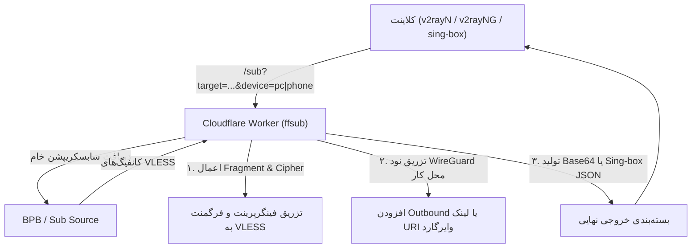

# طرح جامع یکپارچه‌سازی سابسکریپشن و وایرگارد محل کار (ffsub WireGuard Integration Plan)

این سند معماری و نقشه پیاده‌سازی اتصال همزمان به شبکه محل کار (از طریق WireGuard روتر مسترمایند) و عبور از محدودیت‌های اینترنت با پروتکل‌های ضد فیلترینگ (BPB / VLESS Fragment) را از طریق ارتقاء ورکر کلودفلر `ffsub` مدون می‌کند.

---

## ۱. وضعیت و یافته‌های استخراج‌شده از شبکه (Network Audit)

با اتصال زنده به روتر میکروتیک مرکزی شرکت (`Router-Mastermind`) و بررسی کلیدهای موجود در `~/.config/secrets/wireguard.env`، پارامترهای دقیق زیر استخراج شد:

### مشخصات سرور WireGuard (Mastermind CCR):
- **آدرس پابلیک و پورت:** `217.219.149.57:13231` (UDP)
- **نام اینترفیس در روتر:** `wg-office` (با MTU 1420)
- **کلید عمومی سرور (Public Key):** `jbLKBuddZyCr2TNi216s+7dcF0I1ZuS0I0xk7pTDTkw=`
- **آدرس روتر داخل تونل:** `10.50.0.1/24`

### کلاینت‌ها و کلیدهای متناظر:
| کلاینت | شناسه در روتر | آدرس اختصاصی | کلید عمومی (Public Key) | کلید خصوصی (Private Key) |
| :--- | :--- | :--- | :--- | :--- |
| **کامپیوتر خانه (Home PC)** | `peer1` | `10.50.0.2/32` | `/e6tf1WpFOsijGBAW7XE1znfwe2FdpzarA84A8d/8w4=` | `oN6oNtK03pkqDTnQYQTjWGJ+nyvqi/f9jncQY9/8rnw=` |
| **گوشی موبایل (S24 Ultra)** | `peer2` | `10.50.0.3/32` | `uqKqTGFwvTgx1bIzd8InPdjvGDXdShd/EGBirfKyGUQ=` | `GK7JC3VXuvSbPl5hBuOI5yVwSv2Cre1u1DfALVsagEk=` |

### ساب‌نت‌های داخلی هدف برای روتینگ (Target Subnets):
برای جلوگیری از لوپ شدن یا ارسال بی‌مورد ترافیک اینترنت به شرکت، فقط ساب‌نت‌های زیر باید به تونل وایرگارد هدایت شوند:
1. **`10.50.0.0/24`** — ساب‌نت ارتباطی خود تونل WireGuard
2. **`192.168.1.0/24`** — شبکه اصلی محلی کار (شامل سیستم اداری `192.168.1.100`، سرورها و سوئیچ‌ها)
3. **`192.168.88.0/24`** — شبکه مدیریتی پیش‌فرض روتر

---

## ۲. چالش‌های فنی و نیازمندی‌ها

1. **محدودیت‌های اندروید (Single VpnService):** در گوشی، اجرای همزمان اپلیکیشن رسمی WireGuard و v2rayNG به دلیل وجود تنها یک VpnService فعال امکان‌پذیر نیست؛ مگر اینکه خود کلاینت v2rayNG/sing-box توانایی هندل هر دو پروتکل را به صورت یکپارچه داشته باشد یا اتصال وایرگارد داخل کلاینت به عنوان Outbound تعریف شود.
2. **عدم اختلال هندشیک WireGuard با فیلترشکن:** ترافیک مقصد `217.219.149.57:13231` نباید به هیچ عنوان وارد پراکسی شود (باید حتماً Direct / Bypass باشد).
3. **تفکیک دستگاه‌ها در ورکر:** کلید خصوصی کلاینت کامپیوتر و گوشی متفاوت است، بنابراین سابسکریپشن باید بر اساس پارامتر ورودی تشخیص دهد کانفیگ کدام دستگاه را تزریق کند.

---

## ۳. معماری ورکر ارتقاء‌یافته (`worker.js`)

ورکر کلودفلر مستقر در `ffsub.ajbv.ir` به دو قابلیت کلیدی ارتقا می‌یابد:



### الف) ساختار خروجی استاندارد Base64 (سازگار با تمامی کلاینت‌ها)
ورکر در خروجی متنی، علاوه بر لینک‌های بهینه‌سازی‌شده VLESS، لینک اختصاصی WireGuard را نیز اضافه می‌کند:

- **فرمت لینک برای کامپیوتر (`device=pc`):**
  ```text
  wireguard://oN6oNtK03pkqDTnQYQTjWGJ%2Bnyvqi%2Ff9jncQY9%2F8rnw%3D@217.219.149.57:13231?publickey=jbLKBuddZyCr2TNi216s%2B7dcF0I1ZuS0I0xk7pTDTkw%3D&address=10.50.0.2%2F24#🏢%20Work-Mastermind
  ```
- **فرمت لینک برای گوشی (`device=phone`):**
  ```text
  wireguard://GK7JC3VXuvSbPl5hBuOI5yVwSv2Cre1u1DfALVsagEk%3D@217.219.149.57:13231?publickey=jbLKBuddZyCr2TNi216s%2B7dcF0I1ZuS0I0xk7pTDTkw%3D&address=10.50.0.3%2F24#🏢%20Work-Mastermind
  ```

### ب) ساختار خروجی پیشرفته Sing-box / Xray (حالت `format=singbox` یا `format=json`)
برای استفاده همزمان بدون قطع و وصل و مسیریابی کاملاً خودکار (روشن بودن فیلترشکن و هدایت خودکار پکت‌های اداری به وایرگارد)، ورکر می‌تواند فرمت JSON کامل مشابه `example.json` تولید کند:
- **Outbound ۱:** فیلترشکن VLESS برای اینترنت خارجی (`proxy-out`)
- **Outbound ۲:** وایرگارد اداری برای شرکت (`work-wg`)
- **Outbound ۳:** ارتباط مستقیم برای سایت‌های ایران (`direct`)
- **Routing Rules:**
  - `ip_cidr`: `["10.50.0.0/24", "192.168.1.0/24", "192.168.88.0/24"]` -> `work-wg`
  - `geoip:ir` -> `direct`
  - `final` -> `proxy-out`

---

## ۴. مراحل پیاده‌سازی و استقرار (Action Steps)

### گام ۱: به‌روزرسانی کد ورکر (`worker.js`)
- افزودن کلیدها و پیکربندی وایرگارد به بخش پیکربندی ورکر (امکان تزریق از متغیرهای محیطی Cloudflare Environment یا ثابت‌های امن).
- پشتیبانی از پارامترهای جدید در کوئری:
  - `device`: انتخاب بین `pc` یا `phone` (در صورت خالی بودن، لینک هردو یا لینک کامپیوتر پیش‌فرض باشد).
  - `wg`: فعال یا غیرفعال کردن تزریق وایرگارد (`true`/`false`).
  - `format`: خروجی استاندارد سابسکریپشن متنی یا ساختار کانفیگ کامل JSON.
- به‌روزرسانی رابط وب (Web UI) ورکر برای انتخاب نوع دستگاه و کپی آسان لینک سابسکریپشن.

### گام ۲: تست خروجی ورکر
- اجرای محلی یا فراخوانی مستقیم ورکر و بررسی دیکود Base64 برای اطمینان از قرارگیری صحیح لینک وایرگارد در کنار لینک‌های VLESS.
- تست با ابزارهای کلاینت (v2rayN در کامپیوتر و v2rayNG در گوشی).

### گام ۳: تنظیم قوانین روتینگ (Routing Rules) در کلاینت‌ها
- افزودن رول Direct در v2rayN و v2rayNG برای آدرس عمومی سرور وایرگارد (`217.219.149.57/32`).
- در صورت استفاده از حالت سابسکریپشن استاندارد، اختصاص روتینگ ترافیک ساب‌نت‌های `10.50.0.0/24` و `192.168.1.0/24` به نود WireGuard.
